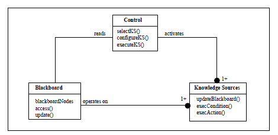

[Blackboard (design pattern)](https://en.wikipedia.org/wiki/Blackboard_(design_pattern))

In software engineering, the blackboard pattern is a behavioral design pattern[1] that provides a computational framework for the design and implementation of systems that used to integrate large and diverse specialized modules, and implement complex, non deterministic control strategies.[2][1]

This pattern has been identified by the members of the HEARSAY-II project and first applied for speech recognition.[2]

## Structure

The blackboard model defines three main components:

* blackboard - a structured global memory containing objects from the solution space
* knowledge sources - highly specialized modules with their own representation
* control component - selects, configures and execute knowledge sources.[2]

## Implementation

First step is to design the solution space (i.e. various solutions) that leads to the definition of blackboard structure. Then, knowledge source are to be identified. These two activities are very related.[2]

The next step is to specify the control component that is generally in the form of a complex scheduler that makes use of a set of domain-specific heuristics to rate the relevance of executable knowledge sources.[2]
System Structure[2]

## Known Uses

Some usage-domains are:

* speech recognition
* vehicle identification and tracking
* identification of the structure of vehicle molecules
* sonar signals interpretation.[2]

##　Consequences

The blackboard pattern provides effective solutions for designing and implementing complex systems where heterogeneous modules have to be dynamically combined to solve a problem. This provides properties such as:

* reusability
* changeability
* robustness.[2]

Blackboard pattern allows multiple processes to work closer together on separate threads, polling, and reacting, if it is needed.[1]