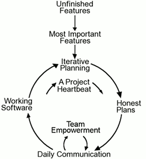

[Extreme Programming:A gentle introduction ](http://www.extremeprogramming.org/)

The first Extreme Programming project was started March 6, 1996. Extreme Programming is one of several popular Agile Processes. It has already been proven to be very successful at many companies of all different sizes and industries world wide.

Extreme Programming is successful because it stresses customer satisfaction. Instead of delivering everything you could possibly want on some date far in the future this process delivers the software you need as you need it. Extreme Programming empowers your developers to confidently respond to changing customer requirements, even late in the life cycle.

Extreme Programming emphasizes teamwork. Managers, customers, and developers are all equal partners in a collaborative team. Extreme Programming implements a simple, yet effective environment enabling teams to become highly productive. The team self-organizes around the problem to solve it as efficiently as possible.

Extreme Programming improves a software project in five essential ways; communication, simplicity, feedback, respect, and courage. Extreme Programmers constantly communicate with their customers and fellow programmers. They keep their design simple and clean. They get feedback by testing their software starting on day one. They deliver the system to the customers as early as possible and implement changes as suggested. Every small success deepens their respect for the unique contributions of each and every team member. With this foundation Extreme Programmers are able to courageously respond to changing requirements and technology.

The most surprising aspect of Extreme Programming is its simple rules. Extreme Programming is a lot like a jig saw puzzle. There are many small pieces. Individually the pieces
	

make no sense, but when combined together a complete picture can be seen. The rules may seem awkward and perhaps even naive at first, but are based on sound values and principles.

Our rules set expectations between team members but are not the end goal themselves. You will come to realize these rules define an environment that promotes team collaboration and empowerment, that is your goal. Once achieved productive teamwork will continue even as rules are changed to fit your company's specific needs.

This flow chart shows how Extreme Programming's rules work together. Customers enjoy being partners in the software process, developers actively contribute regardless of experience level, and managers concentrate on communication and relationships. Unproductive activities have been trimmed to reduce costs and frustration of everyone involved.

Take a guided tour of Extreme Programming by following the trail of littleWhat is an Agile process?buttons , starting here.