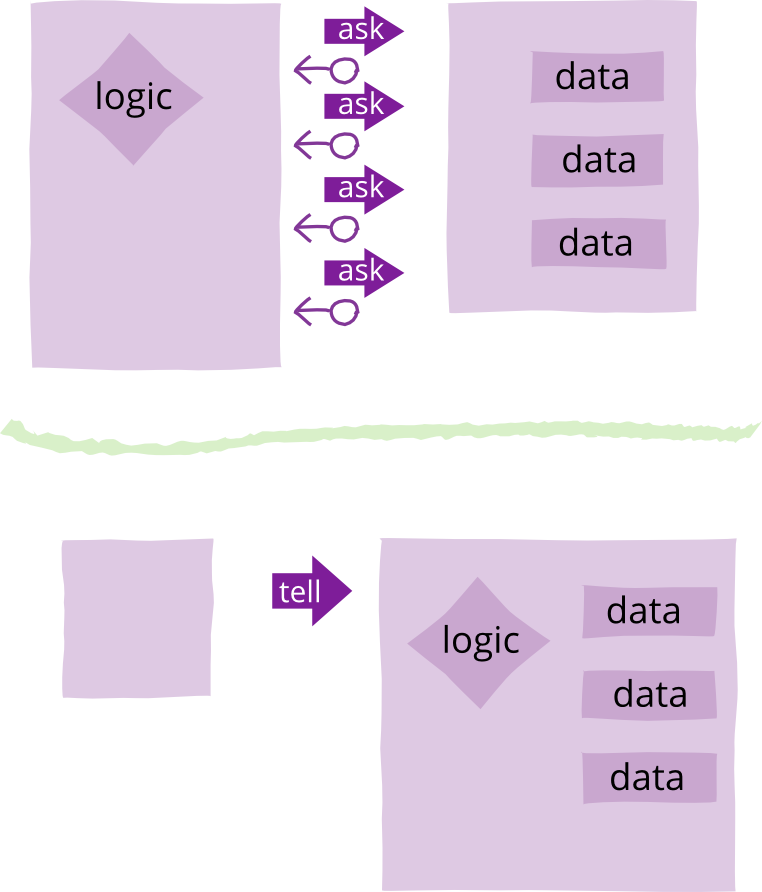

[TellDontAsk](http://martinfowler.com/bliki/TellDontAsk.html)

# [TellDontAsk](TellDontAsk.html)


[encapsulation](/tags/encapsulation.html)&nbsp;· [API design](/tags/API design.html)&nbsp;· [object collaboration design](/tags/object collaboration design.html)

tags:


Tell-Don't-Ask is a principle that helps people remember that
  object-orientation is about bundling data with the functions that
  operate on that data. It reminds us that rather than asking an
  object for data and acting on that data, we should instead tell an
  object what to do. This encourages to move behavior into an object
  to go with the data.



Let's clarify with an example. Let's imagine we need to monitor
  certain values, signaling an alarm should the value rise above a
  certain limit. If we write this in an "ask" style, we might have a
  data structure to represent these things…

class AskMonitor...

``` private int value;
  private int limit;
  private boolean isTooHigh;
  private String name;
  private Alarm alarm;

  public AskMonitor (String name, int limit, Alarm alarm) {
    this.name = name;
    this.limit = limit;
    this.alarm = alarm;
  }
```

…and combine this with some accessors to get at this data

class AskMonitor...

``` public int getValue() {return value;}
  public void setValue(int arg) {value = arg;}
  public int getLimit() {return limit;}
  public String getName()  {return name;}
  public Alarm getAlarm() {return alarm;}
```

We would then use the data structure like this

```AskMonitor am = new AskMonitor("Time Vortex Hocus", 2, alarm);
am.setValue(3);
if (am.getValue() &gt; am.getLimit()) 
  am.getAlarm().warn(am.getName() + " too high");```

"Tell Don't Ask" reminds us to instead put the behavior inside the
 monitor object itself (using the same fields).

class TellMonitor...

``` public void setValue(int arg) {
    value = arg;
    if (value &gt; limit) alarm.warn(name + " too high");
  }
```

Which would be used like this

```TellMonitor tm = new TellMonitor("Time Vortex Hocus", 2, alarm);
tm.setValue(3);```

Many people find tell-don't-ask to be a useful principle. One of
 the fundamental principles of object-oriented design is to combine
 data and behavior, so that the basic elements of our system (objects)
 combine both together. This is often a good thing because this data
 and the behavior that manipulates them are tightly coupled: changes
 in one cause changes in the other, understanding one helps you
 understand the other. Things that are tightly coupled should be in
 the same component. Thinking of tell-don't-ask is a way to help
 programmers to see how they can increase this co-location.

But personally, I don't use tell-dont-ask. I do look to co-locate
 data and behavior, which often leads to similar results. One thing I
 find troubling about tell-dont-ask is that I've seen it encourage
 people to become [GetterEradicators](GetterEradicator.html), seeking to get rid of
 all query methods. But there are times when objects collaborate
 effectively by providing information. A good example are objects that
 take input information and transform it to simplify their clients,
 such as using [EmbeddedDocument](EmbeddedDocument.html). I've seen code get into
 convolutions of only telling where suitably responsible query methods
 would simplify matters [[1]](#footnote-trades). For me,
 tell-don't-ask is a stepping stone towards co-locating behavior and
 data, but I don't find it a point worth highlighting.


## Further Reading

This principle is most often associated with Andy Hunt and
   "Prag" Dave Thomas (The Pragmatic Programmers). They describe it in
   a [IEEE Software
   column](http://media.pragprog.com/articles/jan_03_enbug.pdf) and a [post on their
   website](http://pragprog.com/articles/tell-dont-ask). 


## Notes


<span class="num">1: </span>
     And indeed even the more fundamental principle of co-locating
     data and behavior should sometimes be dropped in favor of other
     concerns - such as layering. Good design is all about trade-offs,
     and co-locating data and behavior is just one factor to bear in
     mind.


**Translations: **[Japanese](http://blog.showqase.com/2014/01/19/translation-tell-dont-ask.html)


<span class="label">Share:</span>[](https://twitter.com/intent/tweet?url=http://martinfowler.com/bliki/TellDontAsk.html&amp;text=Bliki: TellDontAsk ➙  "Share on Twitter")[](https://facebook.com/sharer.php?u=http://martinfowler.com/bliki/TellDontAsk.html "Share on Facebook")[](https://plus.google.com/share?url=http://martinfowler.com/bliki/TellDontAsk.html "Share on Google Plus")

if you found this article useful, please share it. I appreciate the feedback and encouragement


